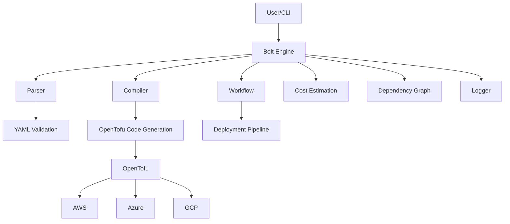
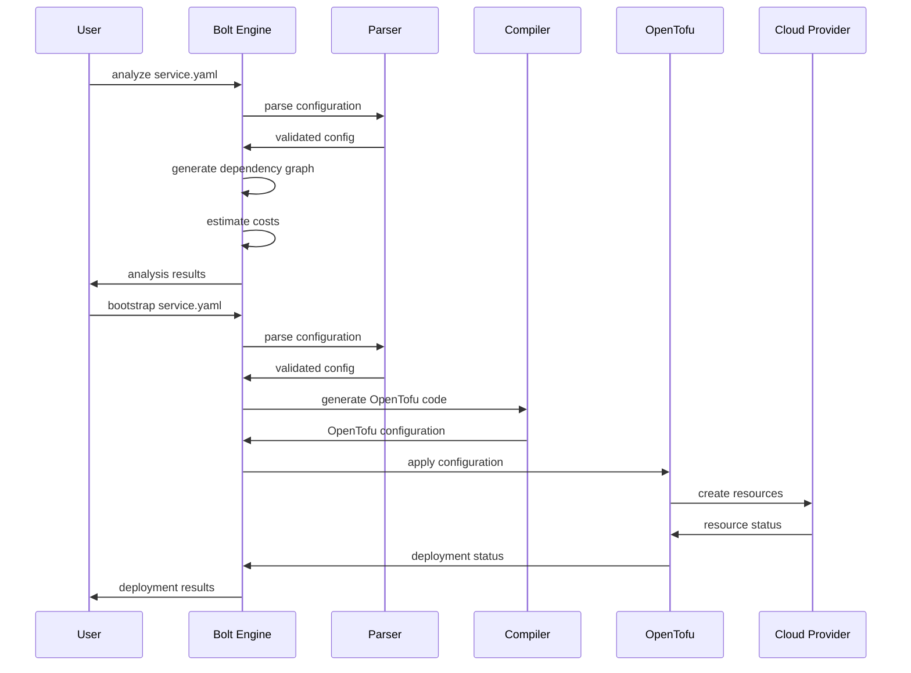

# 🏗️ Bolt Architecture

## Overview

Bolt is designed with a modular, extensible architecture that provides a unified interface for multi-cloud infrastructure management.

## High-Level Architecture

## Core Components

### 1. **Parser** (`pkg/parser/`)
- YAML configuration parsing
- Schema validation
- Multi-provider support
- Input sanitization

### 2. **Compiler** (`pkg/compiler/`)
- OpenTofu code generation
- Provider-specific resource mapping
- Configuration optimization
- Error handling

### 3. **Engine** (`pkg/engine/`)
- Orchestration layer
- State management
- Provider coordination
- Execution pipeline

### 4. **Workflow** (`pkg/workflow/`)
- Deployment strategies
- Rollback mechanisms
- Approval workflows
- Progress tracking

### 5. **Cost** (`pkg/cost/`)
- Resource cost estimation
- Budget tracking
- Optimization recommendations
- Multi-currency support

### 6. **Graph** (`pkg/graph/`)
- Dependency resolution
- Resource relationships
- Visualization generation
- Cycle detection

## Data Flow

## Security Model

### Input Validation
- Schema-based validation
- Type checking
- Sanitization
- Injection prevention

### Provider Security
- Credential management
- Least privilege access
- Audit logging
- Encryption at rest

### Deployment Security
- Approval workflows
- Policy enforcement
- Rollback capabilities
- State verification

## Performance Characteristics

### Scalability
- Concurrent provider operations
- Resource batching
- State caching
- Incremental updates

### Reliability
- Retry mechanisms
- Circuit breakers
- Graceful degradation
- Health checks

### Monitoring
- Structured logging
- Metrics collection
- Performance profiling
- Error tracking

## Extension Points

### Custom Resources
- Plugin architecture
- Resource templates
- Custom validators
- Provider extensions

### Integration APIs
- RESTful endpoints
- Webhook support
- Event streaming
- External tooling

## Future Architecture

### Enterprise Features
- Multi-tenancy
- RBAC system
- Audit trails
- Policy engine

### Advanced Capabilities
- GitOps integration
- CI/CD pipelines
- Web dashboard
- Mobile app 